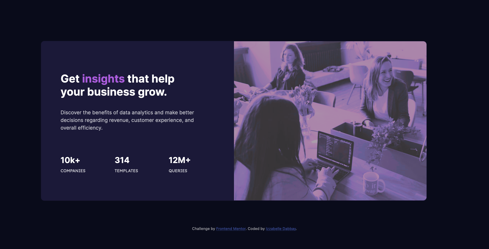

# Frontend Mentor - Stats preview card component solution

This is a solution to the [Stats preview card component challenge on Frontend Mentor](https://www.frontendmentor.io/challenges/stats-preview-card-component-8JqbgoU62). Frontend Mentor challenges help you improve your coding skills by building realistic projects.

## Table of contents

- [Overview](#overview)
  - [The challenge](#the-challenge)
  - [Screenshot](#screenshot)
  - [Links](#links)
- [My process](#my-process)
  - [Built with](#built-with)
  - [What I learned](#what-i-learned)
  - [Continued development](#continued-development)
  - [Useful resources](#useful-resources)
- [Author](#author)

## Overview

### The challenge

Users should be able to:

- View the optimal layout depending on their device's screen size

### Screenshot

Desktop view:


Mobile view:


### Links

- Solution URL: [Add solution URL here](https://your-solution-url.com)
- Live Site URL: [Add live site URL here](https://your-live-site-url.com)

## My process

### Built with

- Semantic HTML5 markup
- CSS custom properties
- Bootstrap 5

### What I learned

For this challenge, I had to figure out how to reverse the default Bootstrap order of the card image depending on the device screen size. To do this, I used Bootstrap's order classes

```html

<div class="col-sm-12 col-lg-6 body">
```

I also learned how to change image colors by adding CSS filters. Although the color is slightly off from the guide, I'm still very proud of how close I got it to be!

```js
.image-header {
  filter: invert(1%) sepia(20%) saturate(1800%) hue-rotate(220deg) brightness(78%) contrast(60%);
  border-top-right-radius: 10px;
  border-bottom-right-radius: 10px;
}
```

### Continued development

It took me a while to figure out how to reverse the default Bootstrap oder for the card image so I would like to practice more using Bootstrap Grids and columns.

### Useful resources

- [Bootstrap 5 Docs](https://getbootstrap.com/docs/5.0/getting-started/introduction/) - Amazing framework for building responsive sites! Super challenging to learn for total beginners like myself but the more you use it, the more easy it gets.
- [Codepen CSS image filter generator](https://codepen.io/sosuke/pen/Pjoqqp) - This saved me so much time figuring out the values for the CSS Image filters. Will be using this in the future!


## Author

- Frontend Mentor - [@izzabelledabbay](https://www.frontendmentor.io/profile/izzabelledabbay)
